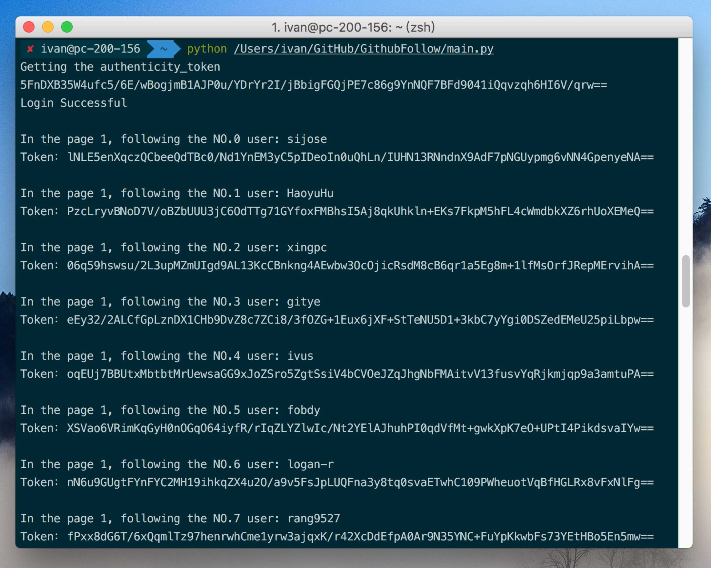

# AutoGithub
This is a project written in python.

- [x] Automatically follow a lot of Github users.
- [x] Automatically find and output the awesome repo your firends staring or forking in the dashborad.
- [ ] Automatically star awesome repo. // TODO
 
## Github Follow
Automatically follow a lot of Github users.

Try to edit it in the file named `GithubFollow.py`.

```python
# new object GithubFollow with parm1:username parm2:password
gt = GithubFollow('username','password')

# login
gt.login()

# range 1,100 is the page of follower page
for i in range(1,100):
    gt.listFollow(i,'yfgeek')
    #The person who you want to copy his follower to yours

```



Drink some ☕️ and enjoy it!

## Github Awesome

Automatically find and output the awesome repo your firends staring or forking in the dashborad.


Try to edit it in the file named `GithubFollow.py`.

```python
ga = GithubAwesome('username','password')
        # login
        ga.login()
        # get awesome repo param is the page you want to see
        ga.get_awesome(1,20,50) # page 1 ,the output rule: min star 20 min or fork 20
```

You will find a lot of awesome projects if you are following more than 1K github users.

Have a nice day! 😁


