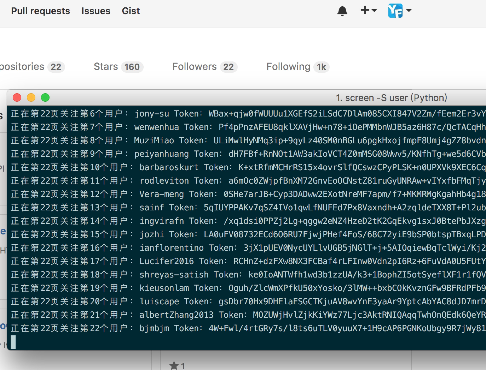

# Github Follow
Automatically follow a lot of Github users.

Try to edit it in the python code.

```python
# new obejc parm1:username parm2:password
gt = Github('username','password')

# login
gt.login()

# range 1,100 is the page of follower page
for i in range(1,100):
    gt.listFollow(i,'yfgeek')
    #The person who you want to copy his follower to yours

```



Enjoy!😁
