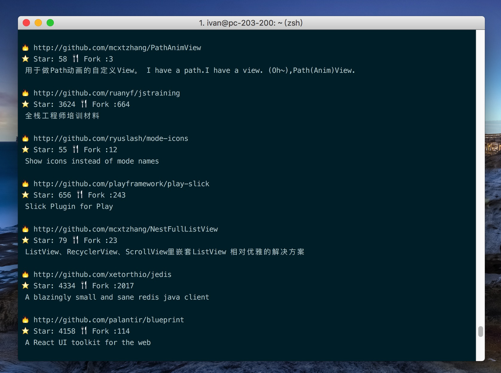

# Github Awesome

Automatically find and output the awesome repo your friends staring or forking in the dashborad.

### Rule 
If the vaule of star or fork in the repo your friends staring of forking is more than you set up before, it will output as an awesome project.

🌰 E.g.
```
min star: 50
min fork: 50
```



### Set up

To confirm you have installed beautifulsoup4.

```
pip install beautifulsoup4
```

Try to edit it in the file named `GithubAwesome.py`.

```python
ga = GithubAwesome('username','password')
# login
ga.login()
# get awesome repo param is the page you want to see
ga.get_awesome(1,20,50) # page 1 ,the output rule: min star 20 min or fork 20
```

You will find **a lot of awesome projects everyday** if you are following more than 1K github users.

Have a nice day! 😁


